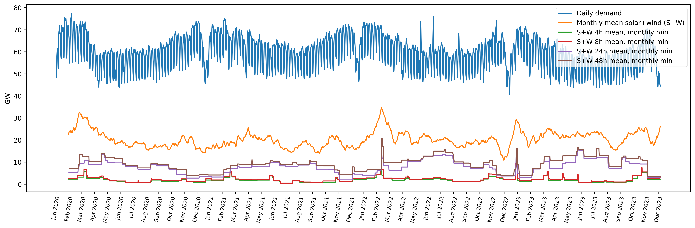

# An Argument for Short-Term Electricity Storage

The [colab notebook](https://colab.research.google.com/drive/1FS39nLjJtmC_aXzcK50ym7iYJUeJGC89?usp=sharing) was used to make an argument for wind and solar energy generation in combination with short-term electricity storage.

### Data is from:

https://www.agora-energiewende.org/data-tools/agorameter/chart/today/power_generation/01.01.2021/30.11.2023/daily

### The Argument:

The plot generated in this notebook shows that electricity storage significantly mitigates the intermittency problem of solar and wind generation. The electricity storage is naively modelled as the `max()` function over windows of 4h, 8h, 24h and 48h.
It can be seen, that a time scale of 24h and 48h is superior over 4h and 8h regarding minimum generation over the year. Also 48h does not perform significantly better than 24h.

